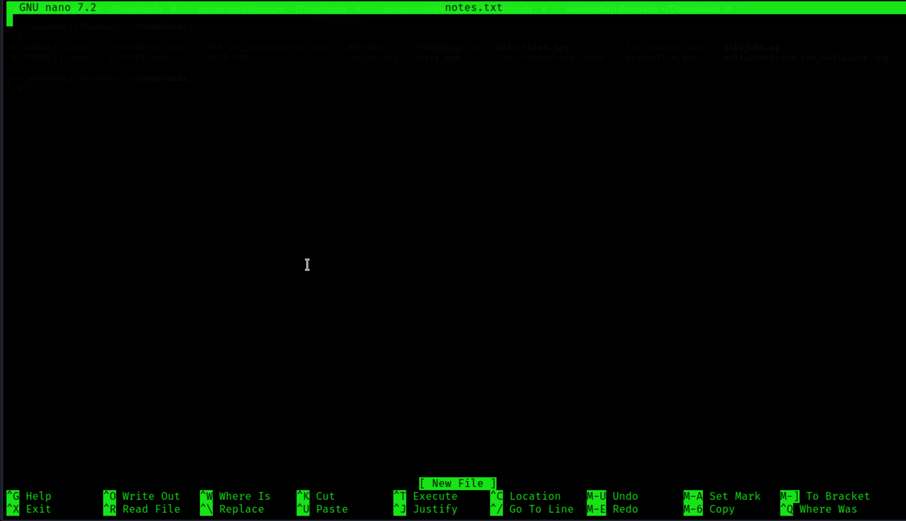
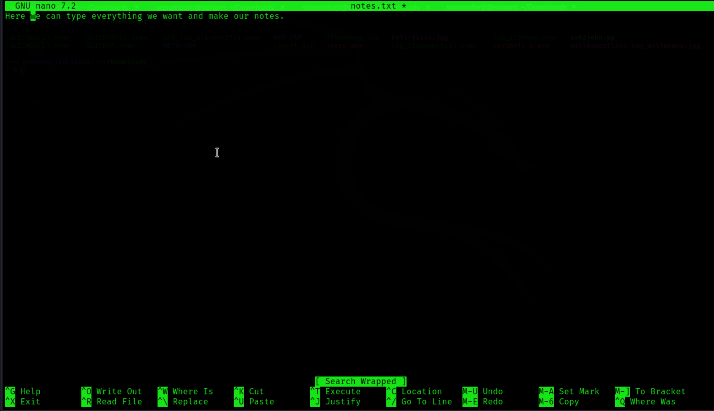

## Editing Files

After learning how to create files and directories, let’s move on to working with these files. There are several ways to edit a file in Linux, with some of the most common text editors being Vi and Vim. However, we will start with the Nano editor, which is less
commonly used but easier to understand.

To create and edit a file using Nano, you can specify the file name directly as the first parameter when launching the editor. For example, to create and open a new file named notes.txt, you would use the following command:

This command will open the Nano editor, allowing you to start editing the file notes.txt immediately. Nano’s straightforward interface (also called "pager") makes it a great choice for quickly editing text files, especially when you’re just getting started.

### Nano Editor

Below we see two lines with short descriptions. The caret (^) stands for our "[CTRL]" key. For example, if we press [CTRL + W], a "Search:" line appears at the bottom of the editor, where we can enter the word or words we are looking for. If we now search
for the word "we" and press [ENTER], the cursor will move to the first word that matches.

To jump to the next match with the cursor, we press [CTRL + W] again and confirm with [ENTER] without any additional information.

Now we can save the file by pressing [CTRL + O] and confirm the file name with [ENTER]. After we have saved the file, we can leave the editor with [CTRL + X].

### Back to shell

To view the contents of the file, we can use the command “cat”.

On Linux systems, there are several files that can be tremendously beneficial for penetration testers, due to misconfigured permissions or insufficient security settings by the administrators. One such important file is the /etc/passwd file. This file contains essential information about the users on the system, such as their usernames, user IDs (UIDs), group IDs (GIDs), and home directories.

Historically, the /etc/passwd file also stored password hashes, but now those hashes are typically stored in /etc/shadow, which has stricter permissions. However, if the permissions on /etc/passwd or other critical files are not set correctly, it may expose sensitive information or lead to privilege escalation opportunities.

As penetration testers, identifying files with improper rights or permissions can provide key insights into potential vulnerabilities that might be exploited, such as weak user accounts or misconfigured file access that should otherwise be restricted. Understanding these files is vital when assessing the security posture of a system.

## VIM

Vim is an open-source editor for all kinds of ASCII text, just like Nano. It is an improved clone of the previous Vi. It is an extremely powerful editor that focuses on the essentials, namely editing text. For tasks that go beyond that, Vim provides an interface to external programs, such as grep, awk, sed, etc., which can handle their specific tasks much better than a corresponding function directly implemented in an editor usually can. This makes the editor small and compact, fast, powerful, flexible, and less error-prone.

In contrast to Nano, Vim is a modal editor that can distinguish between text and command input. Vim offers a total of six fundamental modes that make our work easier and make this editor so powerful:

| Mode | Description |
| --- | --- |
| Normal | In normal mode, all inputs are considered as editor commands. So there is no insertion of the entered characters into the editor buffer, as is the case with most other editors. After starting the editor, we are usually in the normal mode. |
| Insert | With a few exceptions, all entered characters are inserted into the buffer. |
| Visual | The visual mode is used to mark a contiguous part of the text, which will be visually highlighted. By positioning the cursor, we change the selected area. The highlighted area can then be edited in various ways, such as deleting, copying, or replacing it. |
| Command | It allows us to enter single-line commands at the bottom of the editor. This can be used for sorting, replacing text sections, or deleting them, for example. |
| Replace  | In replace mode, the newly entered text will overwrite existing text characters unless there are no more old characters at the current cursor position. Then the newly entered text will be added. |
| Ex | Emulates the behavior of the text editor Ex, one of the predecessors of Vim. Provides a mode where we can execute multiple commands sequentially
without returning to Normal mode after each command. |

When we have the Vim editor open, we can go into command mode by typing ":" and then typing "q" to close Vim.

Vim offers an excellent opportunity called vimtutor to practice and get familiar with the editor. It may seem very difficult and complicated at first, but it will only feel that way for a short time. The efficiency we gain from Vim once we get used to it is
enormous. Entering the tutor mode in vim editor can be done using the Command mode :Tutor or by using the vimtutor command
in the shell.

