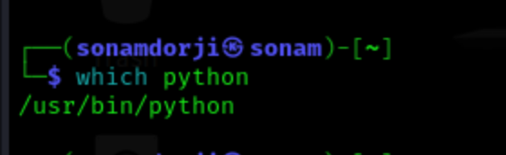
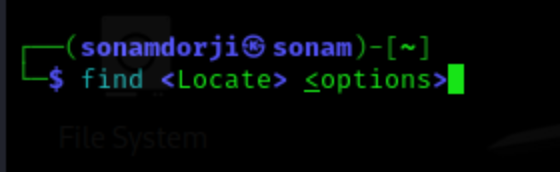
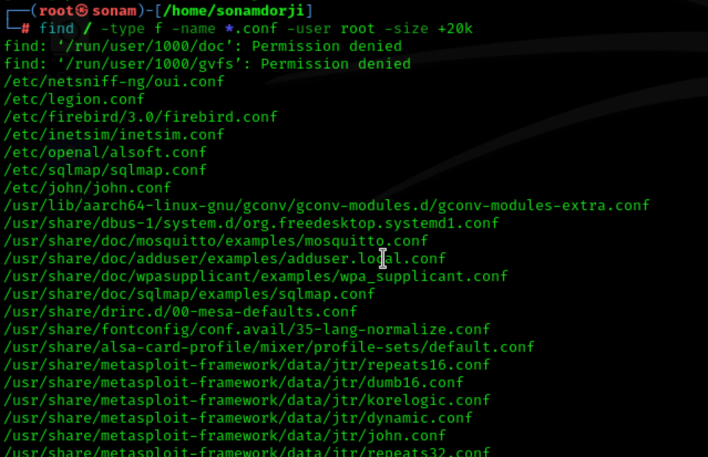
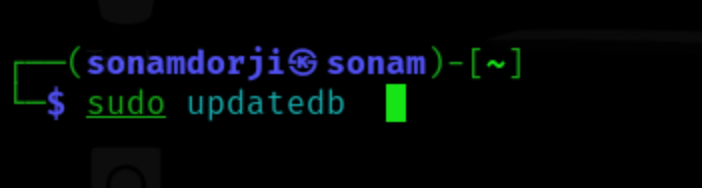
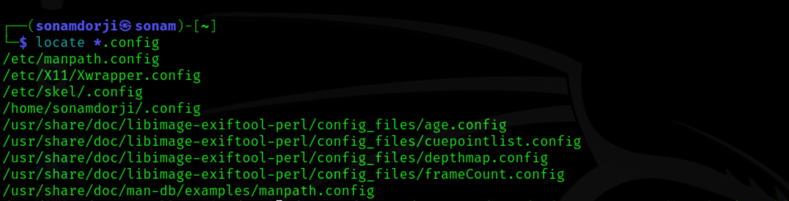

## Find Files and Directories

It is crucial to be able to find the files and folders we need. Once we have gained access to a Linux based system, it will be essential to find configuration files, scripts created by users or the administrator, and other files and folders. We do not have to manually browse through every single folder and check when modified for the last time. There are some tools we can use to make this work easier.

### Which

One of the common tools is which. This tool returns the path to the file or link that should be executed. This allows us to determine if specific programs, like cURL, netcat, wget, python, gcc, are available on the operating system. Let us use it to search for Python in our interactive instance.

If the program we search for does not exist, no results will be displayed.

### Find

Another handy tool is find. Besides the function to find files and folders, this tool also contains the function to filter the results. We can use filter parameters like the size of the file or the date. We can also specify if we only search for files or folders

**Syntax- Find**

Let us look at an example of what such a command with multiple options would look like.

| Option  | Description  |
| --- | --- |
| -type f | Hereby, we define the type of the searched object. In this case, 'f' stands for 'file' |
| -name *.conf | With '-name', we indicate the name of the file we are looking for. The asterisk (*) stands for 'all' files with the '.conf' extension. |
| -user root | This option filters all files whose owner is the root user. |
| -size +20k | We can then filter all the located files and specify that we only want to see the files that are larger than 20 KiB. |

### Locate

It will take much time to search through the whole system for our files and directories to perform many different searches. The command locate offers us a quicker way to search through the system. In contrast to the find command, locate works with a local database that contains all information about existing files and folders. We can update this database with the following command.

If we now search for all files with the ".conf" extension, you will find that this search produces results much faster than
using find.

However, this tool does not have as many filter options that we can use. So it is always worth considering whether we can use the locate command or instead use the find command. It always depends on what we are looking for.