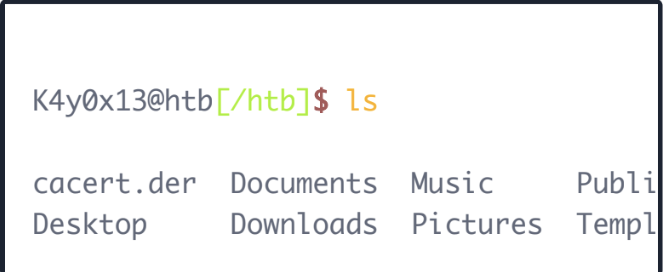
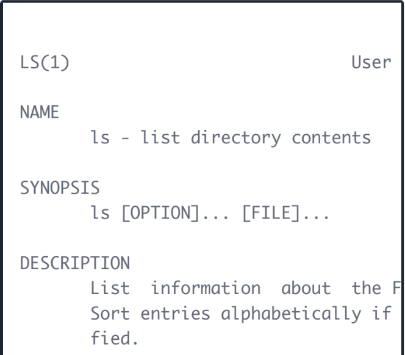
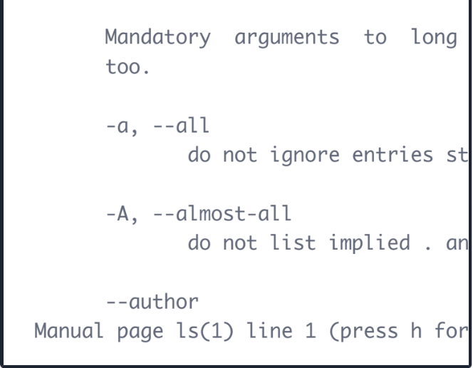
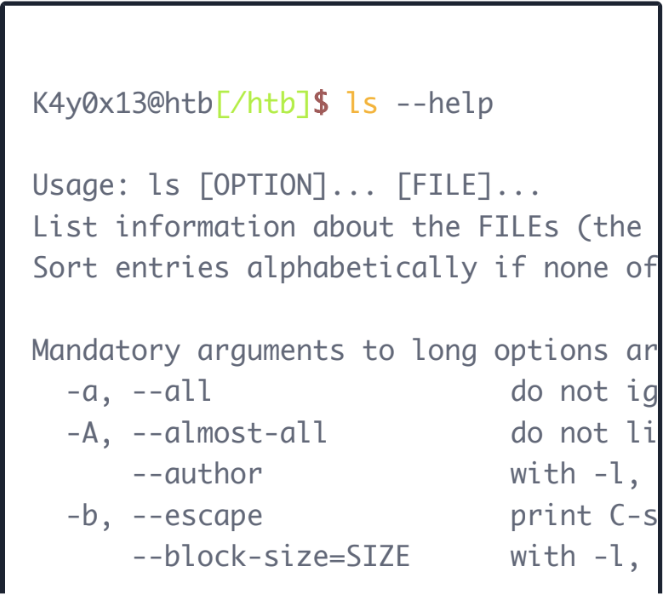
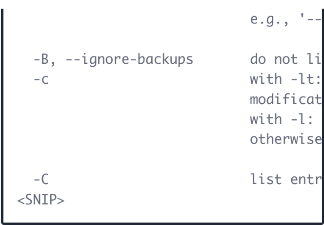
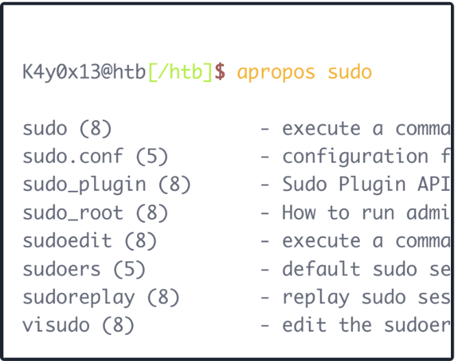

## Getting Help

Having established a solid foundation in Linux's structure, its various distributions, and the purpose of the shell, we're now prepared to put this knowledge into action. It's time to dive in, using commands directly in the terminal, as well as learning how to seek help when we encounter unfamiliar ones.

We will always stumble across tools whose optional parameters we do not know from memory or tools we have never seen before. Therefore it is vital to know how we can help ourselves to get familiar with those tools. The first two ways are the man pages and the help functions. It is always a good idea to familiarize ourselves with the tool we want to try first. We will also learn some possible tricks with some of the tools that we thought were not possible. In the man pages, we will find the detailed manuals with detailed explanations.

The ls command in Linux and Unix system is used to list the files and directories within the current folder or any specific directory, allowing you to see what’s inside and manage files more effectively. like most Linux commands , ls comes with additional option and feature s that help you to filter or format the output to display exactly what you want. to discover which option a tool or command offers, there are several ways to get help. One such method is using the man command , which displays the manual pages for command and provide details information about their usage.

**syntax:** 

Example: 

!

After looking at some examples, we can also quickly look at the optional parameters without browsing through the complete documentation. We have several ways to do that.

Syntax:

example: 

Some tools or commands like curl provide a short version of help by using -h instead of --help.

As we can see, the results from each other do not differ in this example. Another tool that can be useful in the beginning is apropos. Each manual page has a short description available within it. This tool searches the descriptions for instances of a given keyword.

Syntax:

example:

Another useful resource to get help if we have issues to understand a long command is: [https://explainshell.com/](https://explainshell.com/)

Next, we'll be covering a large number of commands, many of which may be new to you. However, you now know how to seek help with any command you’re unfamiliar with, or unsure about its options. Also, we highly encourage you to explore your curiosity, taking as much time as needed to tinker and experiment with the tools presented. It will always be time well spent.