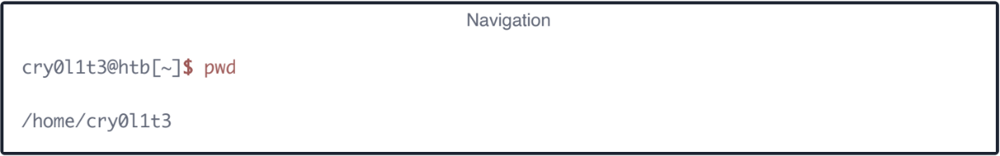
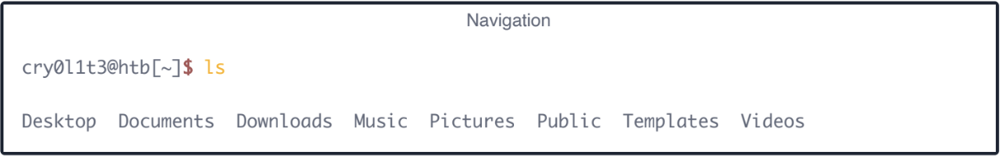
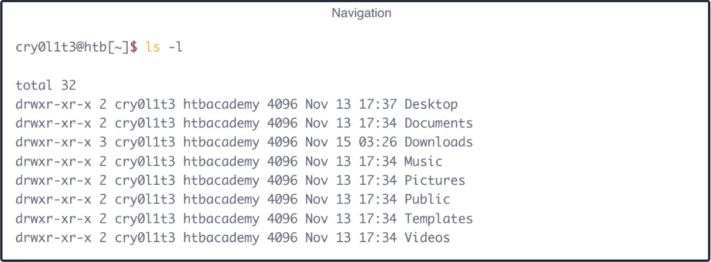
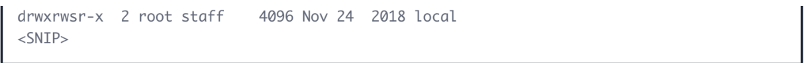
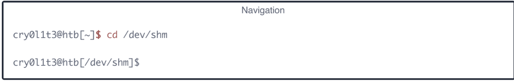
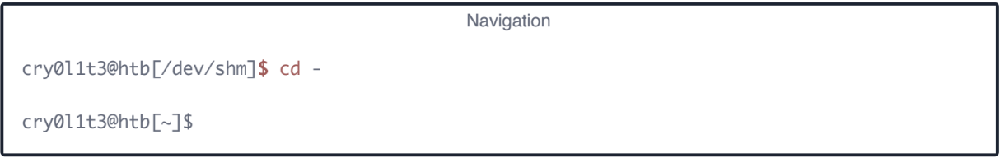
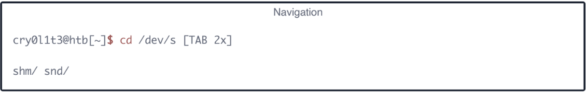

Navigation is essential, like working with the mouse as a standard Windows user. With it, we move across the system and work in directories and with files, we need and want. Therefore, we use different commands and tools to print out information about a directory or a file and can use advanced options to optimize the output to our needs.

One of the best ways to learn something new is to experiment with it. Here we cover the sections on navigating through Linux, creating, moving, editing, and deleting files and folders, finding them on the operating system, different types of redirects, and what file descriptors are. We will also find shortcuts to make our work with the shell much easier and more comfortable. We recommend experimenting on our locally hosted VM. Ensure we have created a snapshot for our VM in case our system gets unexpectedly damaged.

Let us start with the navigation. Before we move through the system, we have to find out in which directory we are. We can find out where we are with the command pwd.

Only the ls command is needed to list all the contents inside a directory. It has many additional options that can complement
the display of the content in the current folder.

Using it without any additional options will display the directories and files only. However, we can also add the -l option to display more information on those directories and files.

We can do the same thing to navigate to the directory. To move through the directories, we use the command cd. Let us change to the /dev/shm directory. Of course, we can go to the /dev directory first and then /shm. Nevertheless, we can also enter the full path and jump there.

Since we were in the home directory before, we can quickly jump back to the directory we were last in.

The shell also offers us the auto-complete function, which makes navigation easier. If we now type cd /dev/s and press [TAB]
twice, we will get all entries starting with the letter “s” in the directory of /dev/.

The first entry with a single dot (.) indicates the current directory we are currently in. The second entry with two dots (..) represents the parent directory /dev. This means we can jump to the parent directory with the cd.. command.

Since our shell is filled with some records, we can clean the shell with the command clear. First, however, let us return to the directory /dev/shm before and then execute the clear command to clean up our terminal. 

Another way to clean up our terminal is to use the shortcut [Ctrl] + [L]. We can also use the arrow keys (↑ or ↓) to scroll through the command history, which will show us the commands that we have used before. But we also can search through the command history using the shortcut [Ctrl] + [R] and type some of the text that we are looking for.